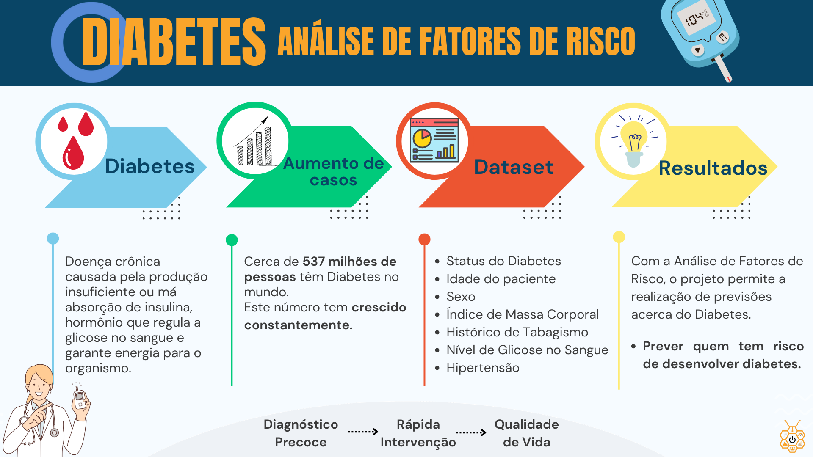
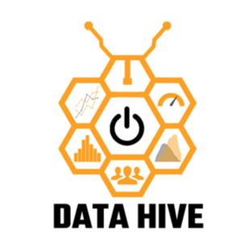

# Predição de Diabetes: Análise de Fatores de Risco e Classificação

## Resumo
O Diabetes é uma doença crônica incurável causada pela produção insuficiente ou pela má absorção de insulina, um hormônio produzido pelo pâncreas que regula a glicose no sangue e garante energia para o organismo. Hoje, mais de meio bilhão de pessoas são afetadas pela condição, com um constante crescimento no número de casos nos últimos anos. Em decorrência disso, é importante facilitar a identificação da doença para os profissionais da área da saúde e, principalmente, para a população em geral, uma vez que o diagnóstico precoce e a rápida intervenção são essenciais para assegurar a qualidade de vida dos pacientes, que devem realizar o controle medicamentoso e comportamental a fim de evitar complicações como cegueira, infarto e até amputação de membros.  
Este projeto analisa o [Diabetes prediction dataset](https://www.kaggle.com/datasets/iammustafatz/diabetes-prediction-dataset/data), permitindo a realização de previsões acerca do Diabetes por meio da identificação de padrões e tendências.  
Utilizando técnicas de Ciências de Dados e de Aprendizado de Máquina, foram realizadas a Análise Exploratória, para investigar as principais características do conjunto de dados, a Preparação dos Dados, para tratar os dados brutos e permitir o funcionamento dos modelos, e a Análise Comparativa de Modelos, para identificar qual o melhor modelo a ser considerado. 

## Graphical Abstract

## Desenvolvedores
 - [Maria Fernanda Cordeiro](https://github.com/Fernanda-Cordeiro)
 - [Nágila Duarte](https://github.com/NagilaDuarte)
 - [Nicole Souza](https://github.com/nicolesouzab)
 - [Paulo Eduardo de Souza](https://github.com/Paulo3078)
 - [Renan Teixeira](https://github.com/renantleite) 

